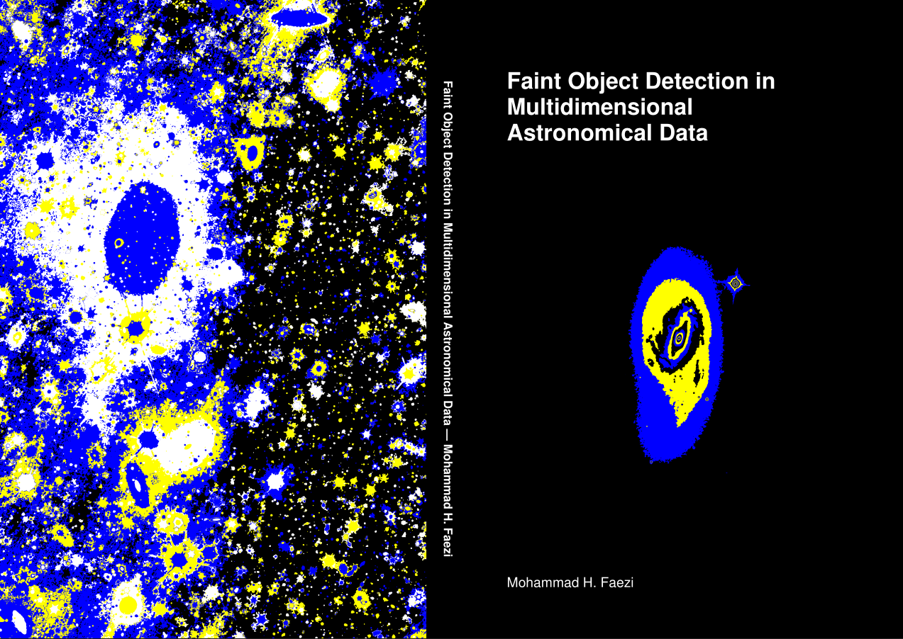

# Hi, I'm Mohammad Faezi 👋🏽

**AI Researcher & Software Engineer** | Bridging advanced machine learning with scalable, real-world systems.

<!-- Add your actual Google Scholar profile ID to the link above -->

I am a Ph.D. candidate in Computer Science at the University of Groningen, specializing in Intelligent Systems. My passion lies in developing novel machine learning algorithms and deploying them as high-performance, scalable software solutions. I thrive on solving complex problems at the intersection of AI, large-scale data processing, and decentralized systems.

---

## 🚀 Highlights & Expertise

*   **🤖 Machine Learning:** Advanced algorithm design, mathematical morphology, computer vision, and deep neural networks.
*   **⚙️ Software Engineering:** Scalable backend services, microservices, API design, and event-driven architectures.
*   **🔄 MLOps & DevOps:** End-to-end CI/CD automation, Docker, Kubernetes, and cloud deployment (AWS/GCP).
*   **💻 High-Performance Computing:** Parallel processing and optimization in Python and C++.
*   **📊 Large-Scale Data:** Building robust, automated pipelines for processing and analyzing massive datasets.

---

## 🛠️ Tech Stack

**Languages:** `Python` | `C++` | `C` | `Go`  
**ML & Data Science:** `PyTorch` | `TensorFlow` | `OpenCV` | `Scikit-learn`  
**Cloud & DevOps:** `Docker` | `Kubernetes` | `AWS/GCP` | `CI/CD` | `MLOps`  
**Systems & Databases:** `SQL` | `NoSQL` | `REST APIs` | `Microservices`  

---

## 📈 GitHub Stats

  
  
  

## 🎓 PhD Thesis

  

    
    

      <h3>Faint Object Detection in Multidimensional Astronomical Data</h3>
      
<strong>University of Groningen</strong> | 2026

      
Doctoral dissertation exploring advanced algorithms for multi-spectral source detection and segmentation in astronomical images.

      

        <a href="#" class="thesis-link" target="_blank">
          📖 Read Full Thesis (PDF)
        </a>
        <a href="#" class="thesis-link" target="_blank">
          🎥 Defense Presentation
        </a>
      

    

  

## 📫 Let's Connect

I'm always open to discussing research, collaboration, or new opportunities.

*   **Email:** [faezi.h.m@gmail.com](mailto:faezi.h.m@gmail.com)
*   **LinkedIn:** [mohammad-faezi](https://linkedin.com/in/mohammad-faezi)
*   **Location:** Groningen, The Netherlands